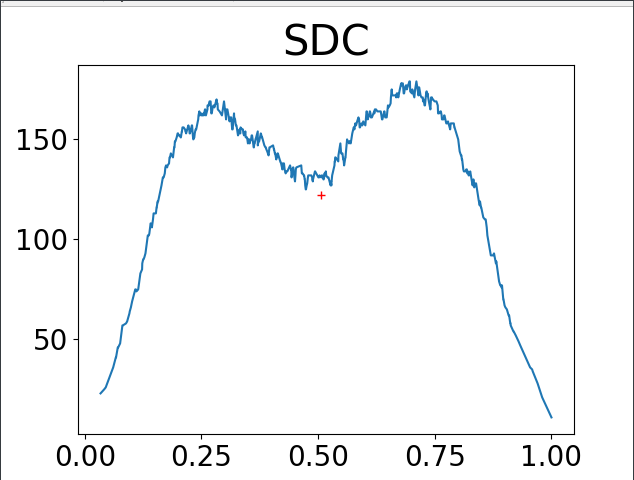
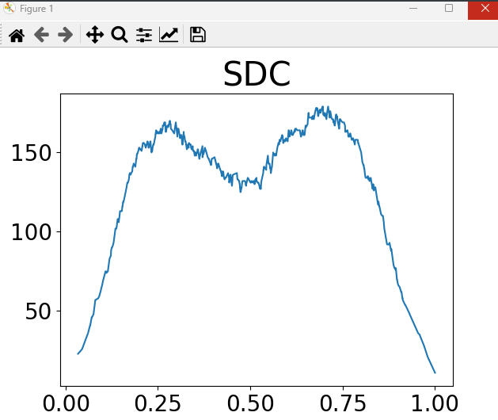

## Call SDC

```
python==3.9
scikit-learn==1.2.2
```

```
Before calling SDC, go to the '/code/SDC' directory and open the folder in the terminal.
```

```
### You maybe need to generate dataset with missing values. You can use following command to generate dataset:
python generateMissingData.py --data_name banknote
### --dataset_name, one of [overlap1, overlap2, birch1, birch2, iris, breast, iris, wine, htru,
                        knowledge, worms, urbanland, WinnipegDataset]
### The generated datasets will be saved in directory '/data/dataset_name/'. After get the datasets, you can execute SDC for clustering.

### You can look for the help information of SDC by executing the follow command
python main.py -h
# python main.py --help
options:
  -h, --help            show this help message and exit
  --save_dir SAVE_DIR   the folder to save results
  --dir DIR             the folder of datasets
  --data_name DATA_NAME
                        dataset name, one of [overlap1, overlap2, birch1, birch2, iris, breast, iris, wine, htru,
                        knowledge, worms, urbanland, WinnipegDataset]
  --ratio RATIO         missing ratio
  --NoEnhance NOENHANCE
                        Whether to use a Non-Enhancement version of SDC
```

```
# examples
#### if you want to call SDC, please execute the follow command
python main.py --dir ../../data/ --save_dir ../../result/ --data_name birch1 --ratio 0.1
```

```
When you execute the SDC, the density decision-graph will be shown, you need to choose some coordinates point with the mouse (you can click multiple points before you press 'Enter', each point's abscissa represent a partition threshold). After choosing, you should press the 'enter' key on your keyboard to confirm thees thresholds you choose, and then close the graph to move on to the next step.
```


- choose partition threshold (the red '+'), and press 'enter' key on your keyboard.



- close current graph to move on to the next step.



- after choosing thresholds for all decision-graphs, we can get the clustering result

## notice

```
The clustering results (cluster partition) are saved at: save_dir + data_name + "/miss_" +str(ratio) + "_clustering_result.txt".
The clustering results (metrics estimation results) are saved at: save_dir + data_name + "/result_SDC_" + str(ratio) + ".csv".
The density decision graphs are saved at the folder: save_dir + data_name. 
```

